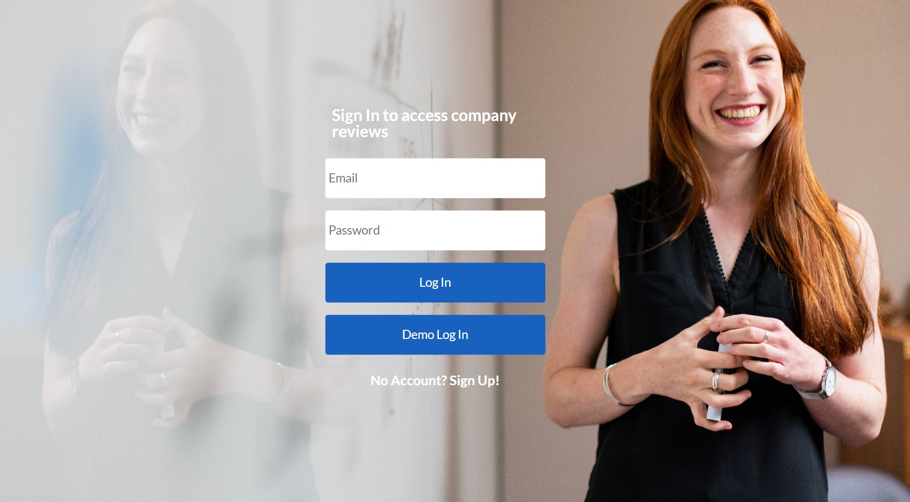

# README

# Table of Contents

### 1) Introduction
### 2) Technology Stack
### 3) Features (with Screen Grabs)

&nbsp;  

# Introduction
## Welcome to Diamond Door README

This README will outline the features, intent, and technology of Diamond Door.

[Diamond Door](https://diamond-door.herokuapp.com/) is a project clone of the popular job review app: Glassdoor. This app was developed as a demonstration of knowledge and skills in the technology stack utillized, and is in no way meant to be monetized. I chose to make a clone of Glassdoor because I found it to have complicated features that would provide logical challenges and a great learning experience. Building this site brought many challenges that I have had a great learning experiencing overcoming. I am proud of the work I was able to accomplish with this full-stack clone and I hope you have time to explore all its features! Feel free to contact me at g.grant92@gmail.com with any questions you may have while exploring my application!
  

# Technology Stack

- Frontend: JavaScript, React.js + Redux.js, HTML, CSS
- Backend: Ruby on Rails
- Additional: AWS S3, Heroku, Google Fonts

&nbsp;

# Features

## 1) User Authentication:

- Diamond Door has the full User Authentication pattern (signup, login, demo login), limiting all of its features to users who create an account/login. Logged in users can see and populate reviews and interviews on companies. Users are also able to edit or delete their profile, reviews, and interviews:

&nbsp;

## 2) Creating, Reading, Updating, and Destroying Reviews:

- As mentioned above, users can add reviews on companies and they also have the ability to edit or delete reviews they have left:

&nbsp;

## 3) Creating, Reading, Updating, and Destroying Interviews:

- Similar to reviews, Users can descripe their interview process with a company:

&nbsp;

## 4) Following and Unfollowing Companies
- Users can follow and unfollow companies. Followed companies will be rendered on the user profile page:

